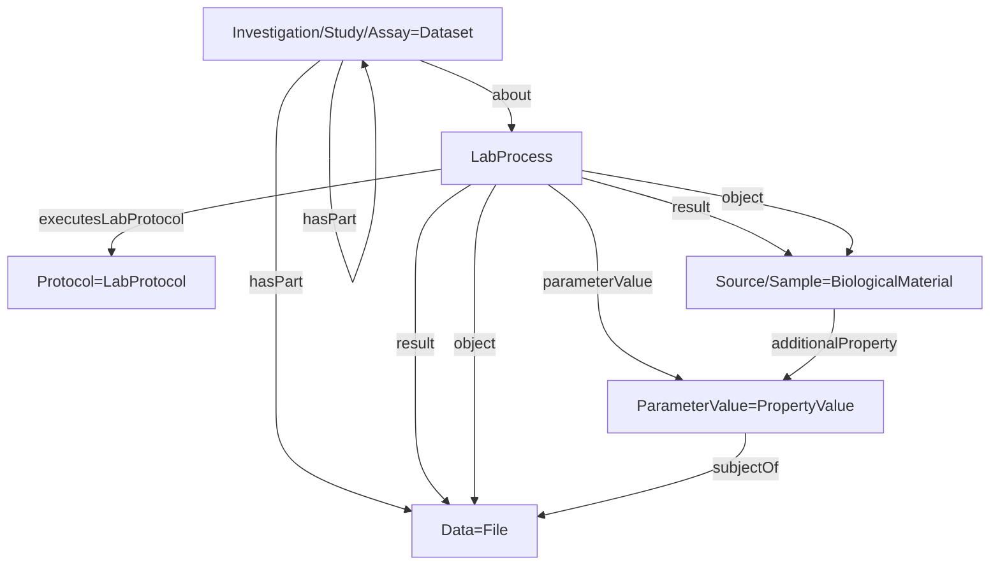

It is a draft and currently a work in progress

# MIAPPE RO-Crate Profile

* Version: 1.0.0-draft.1
* Permalink: _coming soon_
* Authors
  * Cyril Pommier - https://orcid.org/0000-0002-9040-8733
  * Emma Le Roy Pardonche
  * Etienne Bardet
  * ...
* Forked from [ROCrate-ISA profile](https://github.com/nfdi4plants/isa-ro-crate-profile/blob/release/profile/isa_ro_crate.md)
* **Table of contents**
  - [Overview](#overview)
  - [Requirements](#requirements)
    - [Investigation](#investigation)
    - [Study](#study)
    - [Assay](#assay)
    - [Biological Material](#biological-material)
    - [Sample](#sample)
    - [Observed Variable](#observed-variable)
    - [Data](#data)
    - [Person](#person)
    - [ScholarlyArticle](#scholarlyarticle)
    - [DefinedTerm](#definedterm)
    - [PropertyValue](#propertyvalue)
      - [PropertyValue - Parameter](#propertyvalue---parameter)
      - [PropertyValue - Characteristic](#propertyvalue---characteristic)
      - [PropertyValue - Factor](#propertyvalue---factor)
      - [PropertyValue - Component](#propertyvalue---component)
      - [PropertyValue - DOI](#propertyvalue---doi)
      - [PropertyValue - PubMedID](#propertyvalue---pubmedid)
  - [Example ro-crate-metadata.json](#example-ro-crate-metadatajson)

## Overview

This profile iterate over the previous [ROCrate-ISA profile](https://github.com/nfdi4plants/isa-ro-crate-profile/blob/release/profile/isa_ro_crate.md) that was created during the [ELIXIR Biohackathon 2023](https://biohackathon-europe.org/), as part of [Project 14: Enabling continuous RDM using Annotated Research Contexts with RO-Crate profiles for ISA](https://github.com/elixir-europe/biohackathon-projects-2023/tree/main/14), the profile was further fine tuned and defined, and some remaining unresolved mappings resolved.

The following graph summarizes the MIAPPE model in terms of [Bioschemas](https://bioschemas.org/)/[Schema.org](https://schema.org/) vocabulary:

## Description

| MIAPPE Section | Mapping in RO-Crate |
|----------------|---------------------|
|Investigation |Represented as an entity of type Dataset. Uses the `hasPart` property to reference one or several Study entities. |
|Study | Represented as an entity of type Dataset. Uses the `about` property to link to different LabProcesses: **varietal_list** (see BiologicalMaterial) and the  **plot_setup** LabProcess (see ObservationUnit). Uses the `hasPart` property to reference data files|
|Person ||
|Data File |Represented as a ISA File entity. LabProcesses provides the tracability and provenance for the generation of the data files. There is for instance one process, part of an assay, from the experimental site to the phenotyping and/or environment measurment  files. In the example, see  plot_multisite_assay that trace the creation of the raw data files. There is also and plot_to_blues, which trace the generation of derived data (BLUES) from the raw data the transformation from 2a-GrainYield_components_Plot_level.csv to 2b-GrainYield_components_BLUEs_level.csv.|
|Biological Material |Represented by a combination of **Source** and **Sample** entities in RO-Crate. The Source corresponds to MIAPPE’s materialSource, and the Sample corresponds to MIAPPE’s BiologicalMaterial. These two entities are linked via a LabProcess : **varietal_list**, which models the transition between the Source entity and the Sample entity |
|Environment ||
|Observation Unit | There is one plot_setup_[siteName/Year] process per experimental site and possibly year. LabProcess represents the transition from the Sample to the observation unit.|
|Experimental Factor ||
|Event ||
|Sample ||
|Observed Variable |Represented by the **Fragment Descriptors** of type `PropertyValue`. In the descriptor fragments, a `subjectOf` section is used to link observed variables to the corresponding data files.|

## Requirements

### Investigation

Is based upon [schema.org/Dataset](https://schema.org/Dataset) and maps to the [MIAPPE Investigation](https://github.com/MIAPPE/MIAPPE/blob/master/MIAPPE_Checklist_Data_Model.tsv)
We reuse the ISA_RO-Crate profile (https://github.com/nfdi4plants/isa-ro-crate-profile/blob/release/profile/isa_ro_crate.md). 

### Study

Is based upon [schema.org/Dataset](https://schema.org/Dataset) and maps to the [MIAPPE Study]([MIAPPE STUDY](https://github.com/MIAPPE/MIAPPE/blob/master/MIAPPE_Checklist_Data_Model.tsv))
We reuse the ISA_RO-Crate profile (https://github.com/nfdi4plants/isa-ro-crate-profile/blob/release/profile/isa_ro_crate.md) by adding the following list of properties in additionalProperty as propertyValue. 

| Property | Required | Expected Type | Description |
|----------|----------|---------------|-------------|
|additionalPorperty.property.contactInst|MUST| Text	|Name and address of the institution responsible for the study.|
|additionalPorperty.property.locationCountry|MUST| Country name or 2-letter code (ISO 3166)	|The country where the experiment took place, either as a full name or preferably as a 2-letter code.|
|additionalPorperty.property.siteName|MUST|	Text |The name of the natural site, experimental field, greenhouse, phenotyping facility, etc. where the experiment took place.|
|additionalPorperty.property.locationLatitude|SHOULD| degree decimal format (ISO 6709) |Latitude of the experimental site in degrees, in decimal format.|
|additionalPorperty.property.locationLongitude|SHOULD| degree decimal format (ISO 6709)  |Longitude of the experimental site in degrees, in decimal format.|
|additionalPorperty.property.locationAltitude|SHOULD| Numeric + unit abbreviation | Altitude of the experimental site, provided in metres (m).|
|additionalPorperty.property.expeDesignDesc|MUST| Text |Short description of the experimental design, possibly including statistical design. In specific cases, e.g. legacy datasets or data computed from several studies, the experimental design can be "unknown"/"NA", "aggregated/reduced data", or simply "none".|
|additionalPorperty.property.expeDesignType |COULD| URL or Text |Type of experimental design of the study, in the form of an accession number from the Crop Ontology (subclass of "CO_715:0000003" from https://agroportal.lirmm.fr/ontologies/CO_715)|
|additionalPorperty.property.obsUnitLevelHierarchy|COULD| Text |Hierarchy of the different levels of repetitions between each others|
obsUnitDesc	|MUST| Text |General description of the observation units in the study.|
|additionalPorperty.property.growthFacilityDesc|MUST| Text |Short description of the facility in which the study was carried out.|
|additionalPorperty.property.growthFacilityType|SHOULD| Text or URL |Type of growth facility in which the study was carried out, in the form of an accession number from the Crop Ontology (subclass of "CO_715:0000005" from https://agroportal.lirmm.fr/ontologies/CO_715)|
|cadditionalPorperty.property.ulturalPractice|COULD| Text | General description of the cultural practices of the study.|
|additionalPorperty.property.expeDesignMap|COULD| Text or URL |Representation of the experimental design.|

### LabProcess

Is based upon [bioschemas.org/LabProcess](https://bioschemas.org/LabProcess) type and maps to the [ISA-JSON Process](https://isa-specs.readthedocs.io/en/latest/isajson.html#process-schema-json)
We reuse the ISA_RO-Crate profile (https://github.com/nfdi4plants/isa-ro-crate-profile/blob/release/profile/isa_ro_crate.md). 

### LabProtocol

Is based on the Bioschemas [bioschemas.org/LabProtocol](https://bioschemas.org/LabProtocol) type and maps to the [ISA-JSON Protocol](https://isa-specs.readthedocs.io/en/latest/isajson.html#protocol-schema-json)  
We reuse the ISA_RO-Crate profile (https://github.com/nfdi4plants/isa-ro-crate-profile/blob/release/profile/isa_ro_crate.md). 

### Biological Material
Is based upon [MIAPPE Biological Material](https://github.com/MIAPPE/MIAPPE/blob/master/MIAPPE_Checklist_Data_Model.tsv) which borrows concepts from ISA Source and Material. The biological material being studied (e.g. plants grown from a certain bag or seed, or plants grown in a particular field). The original source of that material (e.g., the genebank accession or the commercial variety or the laboratory mutant or line) is called the material source, which, when held by a material repository, should have its stock identified.

We reuse Sample's ISA_RO-Crate profile (https://github.com/nfdi4plants/isa-ro-crate-profile/blob/release/profile/isa_ro_crate.md) by adding the following list of properties in additionalProperty as propertyValue. 

| Property | Required | Expected Type | Description |
|----------|----------|---------------|-------------|
|additionalPorperty.property.biologicalMaterialId|MUST|Unique identifier|Code used to identify the biological material in the data file. Should be unique within the Investigation. Can correspond to experimental plant ID, seed lot ID, etc… This material identification is different from a BiosampleID which corresponds to Observation Unit or Samples sections below.
|additionalPorperty.property.biologicalMaterialExtId|SHOULD|Semicolon-separated list of unique identifiers, possibly prefixed by repository name|One to many identifiers for the biological material. Can include EBI Biosamples ID. URI are recommended when possible.
|additionalPorperty.property.organism|SHOULD|Unique identifier|An identifier for the organism at the species level. Use of the NCBI taxon ID is recommended. <!-- See bioschemas.org taxonomicRange and studies -->
|additionalPorperty.property.genus|SHOULD|Genus name|Genus name for the organism under study, according to standard scientific nomenclature.
|additionalPorperty.property.species|SHOULD|Species name|Species name (formally: specific epithet) for the organism under study, according to standard scientific nomenclature.
|additionalPorperty.property.infraspecificName|SHOULD|Key-value pair list, or MCPD-compliant format|Name of any subtaxa level, including variety, crossing name, etc. It can be used to store any additional taxonomic identifier. To be filled as key-value pair list format (the key is the name of the rank/category and the value is the value of  the rank/category). Ranks/categories can be among the following terms: subspecies, cultivar, variety, subvariety, convariety, group, subgroup, hybrid, line, form, subform. For MCPD compliance, the following abbreviations are allowed: "subsp." (subspecies); "convar." (convariety); "var." (variety); "f." (form); "Group" (cultivar group). MIAPPE adds "cv." (cultivar).
|additionalPorperty.property.biologicalMaterialLatitude|COULD (MUST if longitude is provided)|Degrees in the decimal format (ISO 6709)|Latitude of the studied biological material. [Alternative identifier for in situ material]
|additionalPorperty.property.biologicalMaterialLongitude|COULD (MUST if latitude is provided)|Degrees in the decimal format (ISO 6709)|Longitude of the studied biological material. [Alternative identifier for in situ material]
|additionalPorperty.property.biologicalMaterialAltitude|COULD |Numeric + unit abbreviation|Altitude of the studied biological material, provided in meters (m). [Alternative identifier for in situ material]
|additionalPorperty.property.biologicalMaterialCoordUncertainty|COULD|Numeric|Circular uncertainty of the coordinates, preferably provided in meters (m). [Alternative identifier for in situ material]
|additionalPorperty.property.biologicalMaterialPreprocessing|COULD|Plant Environment Ontology and/or free text|Description of any process or treatment applied uniformly to the biological material, prior to the study itself. Can be provided as free text or as an accession number from a suitable controlled vocabulary.
|additionalPorperty.property.materialSourceId|SHOULD|Unique identifier|An identifier for the source of the biological material, in the form of a key-value pair comprising the name/identifier of the repository from which the material was sourced plus the accession number of the repository for that material. Where an accession number has not been assigned, but the material has been derived from the crossing of known accessions, the material can be defined as follows: "mother_accession X father_accession", or, if father is unknown, as "mother_accession X UNKNOWN". For in situ material, the region of provenance may be used when an accession is not available. The Material source is commonly called germplasm, accession, genotype and even variety for commercial varieties. For the latest, keep in mind that a variety is commonly ambiguously identified and polysemous
|additionalPorperty.property.materialSourceDoi|SHOULD|DOI|Digital Object Identifier (DOI) of the material source
|additionalPorperty.property.materialSourceAccNumber|COULD|Unique identifier|Unique identifier for accessions within a genebank. If material source is not from a genebank, use a laboratory ID. In the case of a commercial variety, use the variety code, or name if no code available.
|additionalPorperty.property.materialSourceAccName| COULD | Text |Can be: (i)genebank accession registered name or other designation given to the material, other than the donor"s accession number or collecting number. (ii) Variety name.
|additionalPorperty.property.materialSourceInstCode| COULD |Unique identifier|FAO WIEWS code of the institute where the accession is maintained. The current set of institute codes is available from https://www.fao.org/wiews. If no institute code is available, create your own (Laboratory acronym or research institute acronym ...).
|additionalPorperty.property.materialSourceInstName| COULD |Institute name|Name of the material source institute.
|additionalPorperty.property.materialSourceOtherIds| COULD |Key:Value pairs|Any other identifiers known to exist in other collections for this material source. Use key:value pairs, separated by semicolons.
|additionalPorperty.property.materialSourceLatitude| COULD ( MUST if longitude is provided)|Degrees in the decimal format (ISO 6709)|Latitude of the material source. [Alternative identifier for in situ material]
|additionalPorperty.property.materialSourceLongitude| COULD ( MUST if latitude is provided)|Degrees in the decimal format (ISO 6709)|Longitude of the material source. [Alternative identifier for in situ material]
|additionalPorperty.property.materialSourceAltitude| COULD |Numeric + unit abbreviation|Altitude of the material source, provided in metres (m). [Alternative identifier for in situ material]
|additionalPorperty.property.aterialSourceCoordUncertainty| COULD |Numeric + unit abbreviation|Circular uncertainty of the coordinates, provided in meters (m). [Alternative identifier for in situ material]
|additionalPorperty.property.materialSourceDesc| COULD | Text |Description of the material sourc

### Sample

Is based on the Bioschemas [bioschemas.org/Sample](https://bioschemas.org/Sample) type, and represents the ISA-JSON [Sample](https://isa-specs.readthedocs.io/en/latest/isajson.html#sample-schema-json),
[Source](https://isa-specs.readthedocs.io/en/latest/isajson.html#source-schema-json) and [Material](https://isa-specs.readthedocs.io/en/latest/isajson.html#material-schema-json)
We reuse the ISA_RO-Crate profile (https://github.com/nfdi4plants/isa-ro-crate-profile/blob/release/profile/isa_ro_crate.md). 

### Observed Variable
Is based upon [MIAPPE Observed Variable](https://github.com/MIAPPE/MIAPPE/blob/master/MIAPPE_Checklist_Data_Model.tsv).

We reuse PropertyValue's ISA_RO-Crate profile (https://github.com/nfdi4plants/isa-ro-crate-profile/blob/release/profile/isa_ro_crate.md) by adding the following list of properties in additionalProperty as propertyValue. 

| Property | Required | Expected Type | Description |
|----------|----------|---------------|-------------|
|additionalPorperty.property.variableId|MUST|Text|Code used to identify the variable in the data file. We recommend using a variable definition from the Crop Ontology where possible. Otherwise, the Crop Ontology naming convention is recommended: <trait abbreviation>_<method abbreviation>_<scale abbreviation>. A variable ID must be unique within a given investigation.
|additionalPorperty.property.variableName|SHOULD|Text|Name of the variable.
|additionalPorperty.property.variableAccNumber|COULD|Text or URL|Accession number of the variable in the Crop Ontology
|additionalPorperty.property.traitName|MUST|Text|Name of the (plant or environmental) trait under observation
|additionalPorperty.property.traitEntity|COULD|Text|Entity (part of the plant, whole plant, group of plant e.g. canopy) on which the trait has been measured
|additionalPorperty.property.traitEntityAccessionNumber|COULD|Text or URL|Accession number of the trait entity in a suitable controlled vocabulary (Plant Ontology). Term from Plant Trait Ontology, Crop Ontology, or XML Environment Ontology
|additionalPorperty.property.traitCharacteristic|COULD|Text|Characteristic measured. It can be a morphological characteristic (size, volume, surface), a molecular characteristic (sugar concentration), etc...
|additionalPorperty.property.traitCharacteristicAccessionNumber|COULD|Text or URL|Accession number of the trait characteristic in a suitable controlled vocabulary (PATO - the Phenotype And Trait Ontology). Term from Plant Trait Ontology, Crop Ontology, or XML Environment Ontology
|additionalPorperty.property.traitAccNumber|COULD|Text or URL|Accession number of the trait in a suitable controlled vocabulary (Crop Ontology, Trait Ontology). Term from Plant Trait Ontology, Crop Ontology, or XML Environment Ontology
|additionalPorperty.property.methodName|MUST|Text|Name of the method of observation
|additionalPorperty.property.methodAccNumber|COULD|Text or URL|Accession number of the method in a suitable controlled vocabulary (Crop Ontology, Trait Ontology). Term from Plant Trait Ontology, Crop Ontology, or XML Environment Ontology
|additionalPorperty.property.methodDesc|SHOULD|Text|Textual description of the method, which may extend a method defined in an external reference with specific parameters, e.g. growth stage, inoculation precise organ (leaf number)
|additionalPorperty.property.methodRef|COULD|Text or URL|URI/DOI of reference describing the method.
|additionalPorperty.property.scaleName|MUST|Text|Name of the scale associated with the variable
|additionalPorperty.property.scaleAccNumber|COULD|Text or URL|Accession number of the scale in a suitable controlled vocabulary (Crop Ontology).
|additionalPorperty.property.timeScale|COULD|Text|Name of the scale or unit of time with which observations of this type were recorded in the data file (for time series studies).

### Data

Describes and points to a Data file <!-- maps to the [ISA-JSON Data](https://isa-specs.readthedocs.io/en/latest/isajson.html#data-schema-json)-->
We reuse the ISA_RO-Crate profile (https://github.com/nfdi4plants/isa-ro-crate-profile/blob/release/profile/isa_ro_crate.md). 

### Person

It is based on [schema.org/Person](https://schema.org/Person), and maps to the MIAPPE-PERSON <!--[ISA-JSON Person](https://isa-specs.readthedocs.io/en/latest/isajson.html#person-schema-json) -->
We reuse the ISA_RO-Crate profile (https://github.com/nfdi4plants/isa-ro-crate-profile/blob/release/profile/isa_ro_crate.md). 

### ScholarlyArticle
    
It is based on [schema.org/ScholarlyArticle](https://schema.org/ScholarlyArticle) and maps to the [ISA-JSON Publication](https://isa-specs.readthedocs.io/en/latest/isajson.html#publication-schema-json)
We reuse the ISA_RO-Crate profile (https://github.com/nfdi4plants/isa-ro-crate-profile/blob/release/profile/isa_ro_crate.md). 

### DefinedTerm

It is based on [schema.org/DefinedTerm](https://schema.org/DefinedTerm) and maps to the [ISA-JSON OntologyAnnotation](https://isa-specs.readthedocs.io/en/latest/isajson.html#ontology-annotation-schema-json)
We reuse the ISA_RO-Crate profile (https://github.com/nfdi4plants/isa-ro-crate-profile/blob/release/profile/isa_ro_crate.md). 

### PropertyValue

General profile for key-value pairs. It is based on [schema.org/PropertyValue](https://schema.org/PropertyValue).
We reuse the ISA_RO-Crate profile (https://github.com/nfdi4plants/isa-ro-crate-profile/blob/release/profile/isa_ro_crate.md). 

#### PropertyValue - Parameter

Represents a process parameter. It is based on [schema.org/PropertyValue](https://schema.org/PropertyValue) and maps to the ISA-JSON Key-Value-Unit Triples [Process Parameter Value](https://isa-specs.readthedocs.io/en/latest/isajson.html#process-parameter-value-schema-json).
We reuse the ISA_RO-Crate profile (https://github.com/nfdi4plants/isa-ro-crate-profile/blob/release/profile/isa_ro_crate.md). 

#### PropertyValue - Characteristic

Represents a characteristic. It is based on [schema.org/PropertyValue](https://schema.org/PropertyValue) and maps to the ISA-JSON Key-Value-Unit Triple [Material Attribute Value](https://isa-specs.readthedocs.io/en/latest/isajson.html#material-attribute-value-schema-json).
We reuse the ISA_RO-Crate profile (https://github.com/nfdi4plants/isa-ro-crate-profile/blob/release/profile/isa_ro_crate.md). 

#### PropertyValue - Factor

Represents a factor. It is based on [schema.org/PropertyValue](https://schema.org/PropertyValue) and maps to the ISA-JSON Key-Value-Unit Triple [Factor Value](https://isa-specs.readthedocs.io/en/latest/isajson.html#factor-value-schema-json).
We reuse the ISA_RO-Crate profile (https://github.com/nfdi4plants/isa-ro-crate-profile/blob/release/profile/isa_ro_crate.md). 

#### PropertyValue - Component

Represents a protocol component. It is based on [schema.org/PropertyValue](https://schema.org/PropertyValue) and maps to the a component of an [ISA-JSON protocol](https://isa-specs.readthedocs.io/en/latest/isajson.html#protocol-schema-json).
We reuse the ISA_RO-Crate profile (https://github.com/nfdi4plants/isa-ro-crate-profile/blob/release/profile/isa_ro_crate.md). 

#### PropertyValue - DOI

If a [schema.org/PropertyValue](https://schema.org/PropertyValue) object represents a [DOI](https://www.doi.org/) identifier of an article, it is supposed to have the following exact values:
We reuse the ISA_RO-Crate profile (https://github.com/nfdi4plants/isa-ro-crate-profile/blob/release/profile/isa_ro_crate.md). 

#### PropertyValue - PubMedID

If a [schema.org/PropertyValue](https://schema.org/PropertyValue) object represents a [PubMedID](https://pubmed.ncbi.nlm.nih.gov/) identifier of an article, it is supposed to have the following exact values:
We reuse the ISA_RO-Crate profile (https://github.com/nfdi4plants/isa-ro-crate-profile/blob/release/profile/isa_ro_crate.md). 

## Example ro-crate-metadata.json

_TODO: simple example and a link to a more complete example_
